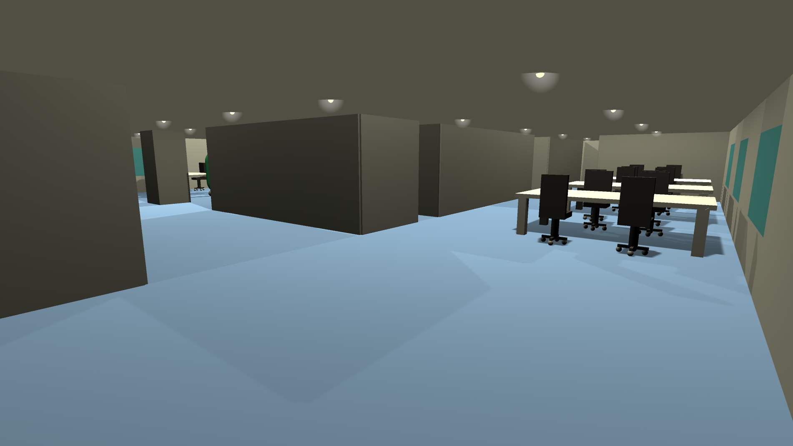
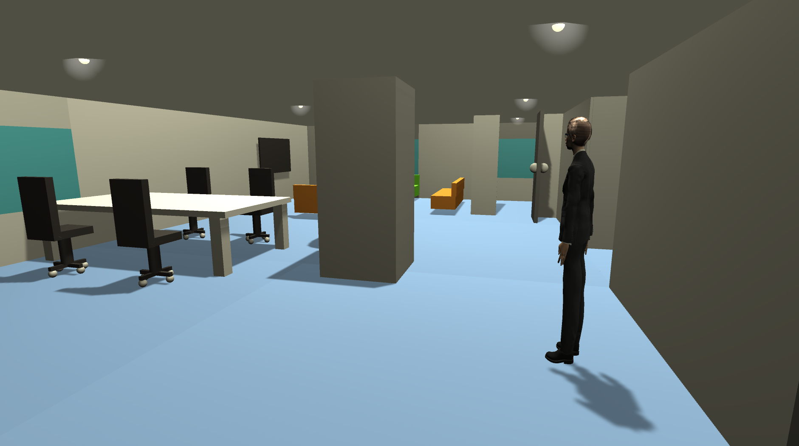

# unity-6eme-etage
FIrst attempt to use unity : find the guy in a work office

#### Goal 

Explore the environment in order to find the character (which is randomly placed at each reset). Get closer enough to him to win.

#### Commands

- to move : <kbd>&uarr;</kbd> , <kbd>&darr;</kbd>, <kbd>&larr;</kbd>, <kbd>&rarr;</kbd>
- to open doors : <kbd>F</kbd>

#### View 

| On reset     | Find the guy     |
|------------|-------------| 
|  |  |
